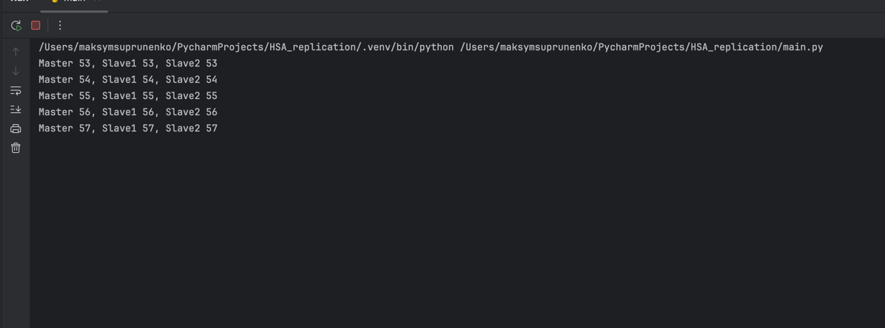
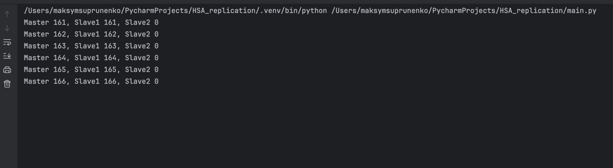
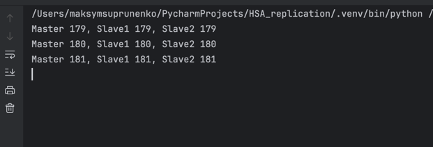

## MySql Replication

It is setup all 3 mysql Database. 1 master, 2 replics; 

The simulation script does next:
- Recreate 3 connections, if the user holds connections to master db, data wont be replicated
- Create a record 
- Wait 2 seconds
- See results from all database 

Case 1. When all databases are up

Case 2. When one of replics down

And spin up a replic again.
As we can see second replic caught up data
